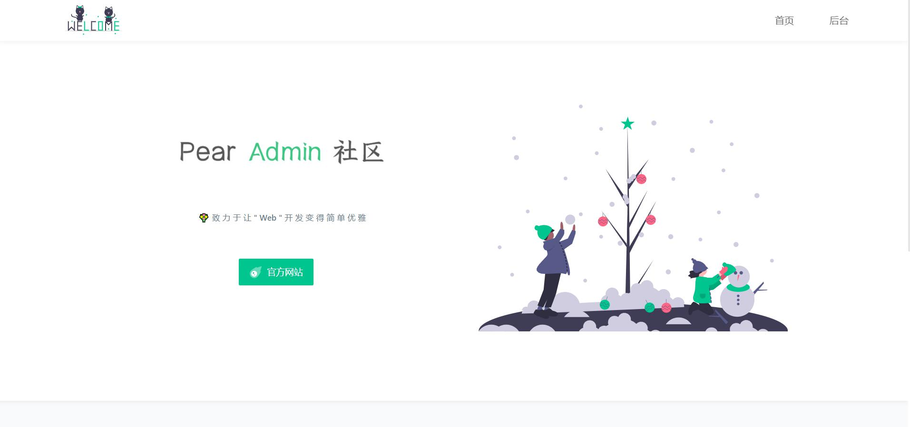

## 项目介绍  :id=start

欢迎阅读 Pear Admin Flask 的开发文档！Pear Admin Flask 是一个基于 Flask 的后台管理系统，拥抱应用广泛的 Python 语言，通过使用本系统，即可快速构建你的功能业务。

项目旨在为 Python 开发者提供一个后台管理系统的模板，成为您构建信息管理系统、物联网后台等应用时灵活、简单的工具。

同时，Pear Admin Flask 项目也是一个对于 Python 初学者友好的项目。此项目处于开发初期，欢迎各位 Python 爱好者加入到 Pear Admin Flask 项目建设中来。如果您在使用此项目的过程中，发现项目代码存在问题，请在 Gitee 上提交 PR ，一起开源共建！

接下来，我们将会为您详细介绍该项目搭建方法与开发架构。

> 如果对项目有不理解的地方欢迎加入我们的讨论群。

> 微信群不定期在qq群更新二维码。

**[master分支版本](https://gitee.com/pear-admin/pear-admin-flask/tree/master/)**

flask 2.0.1 +	flask-sqlalchemy + 权限验证 + Flask-APScheduler 定时任务 + marshmallow 序列化与数据验证

master 分支为主分支，是功能最全、页面最多的分支。

## 下载使用  :id=download

#### 1. 官网地址

官网提供稳定版本的 Release 发行版本 [前往](http://www.pearadmin.com)

#### 2. 源码仓库

如果你需要最新代码，请前往 Gitee 仓库 [前往](https://gitee.com/pear-admin/pear-admin-flask)

如果您完成了这一步，请参阅[下载安装](install.md)章节。

