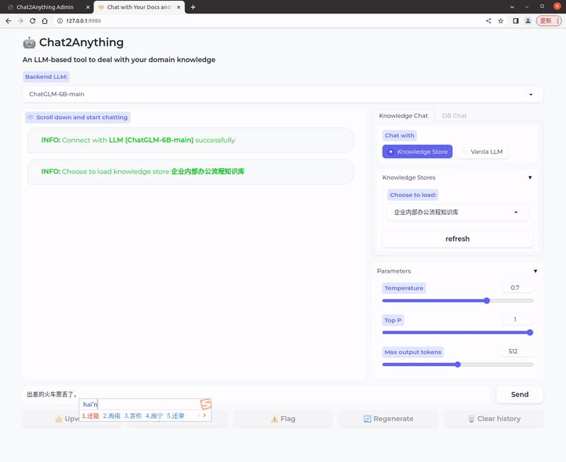
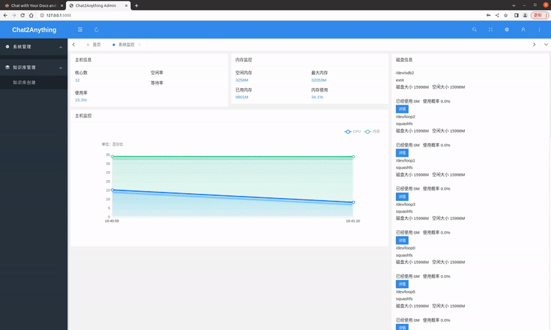

# Chat2Anything

| [**github**](https://github.com/DemoGit4LIANG/Chat2Anything)  |


Chat2Anything是面向企业内部环境的大模型(LLM)知识库问答系统，它具备以下功能：

- 包含客户端(Chat2Anything Admin)与后台管理系统(Chat2Anything Admin)，其中后台管理系统负责大模型知识库的创建与管理，通过Langchain机制向大模型添加企业内部知识；管理系统包含完整的用户权限、角色、组织、数据字典管理等功能
  

- 支持ChatGPT、ChatGLM、Vicuna等主流大模型，用户可随时切换大模型；__当使用ChatGLM、Vicuna时，整套系统可实现完全私域部署，企业数据100%内部流转__


- 数据库接入，收到/自动选择查询分析涉及的表，Text2SQL(待完善)，查询结果可视化(待开发)


  
  </br>
  

## 部署
### Chat2Anything (客户端)
1. 本地配置ChatGLM (https://github.com/THUDM/ChatGLM-6B) / Vicuna (https://github.com/lm-sys/FastChat) 等大模型，如使用ChatGPT，在Chat2Anything/configs/openai_config.py文件中配置OPENAI_API_KEY和OPENAI_API_BASE

2. 运行controller:
    ```bash
    python3 -m fastchat.serve.controller
    ```

3. 
   运行model_worker (ChatGLM-6B, 推荐ChatGLM2-6B (https://github.com/THUDM/ChatGLM2-6B)):
    ```bash
    python3 -m fastchat.serve.model_worker_chatglm --model-path /path/to/model/weights
    ```
   or
   
   运行model_worker (vicuna):
    ```bash
    python3 -m fastchat.serve.model_worker --model-path /path/to/model/weights
    ```
   
   
4. 运行client web server
    ```bash
    python3 -m fastchat.serve.chat2anything_web_server
    ```
   如使用ChatGPT, 添加启动参数 --add-chatgpt


5. 基本测试环境
   
    ```bash
    Ubuntu 20.04 CUDA 11.7 Python 3.9 PyTorch 1.13
    Tesla V100 32GB * 1
    ```


### Chat2Anything Admin (后台管理端)
   1. 数据库(MySQL)配置:
       ```python
       # MySql配置信息
         MYSQL_HOST=数据库地址
         MYSQL_PORT=数据库端口
         MYSQL_DATABASE=chat2anything_db
         MYSQL_USERNAME=账户
         MYSQL_PASSWORD=密码
         
      # 密钥配置
         SECRET_KEY='一定要改'
       ```
      
   2. 模型相关配置:
       ```python
       # model_config.py
         embedding_model_dict = {
         'text2vec": "/Path/to/text2vec-large-chinese',
        }
         
      # 密钥配置
         VECTOR_ROOT_PATH = os.path.join('/Path/to/Chat2Anything', 'vector_stores')
       ```

   3. 数据库初始化:
      ```bash
        flask db init
        flask db migrate
        flask db upgrade
        flask admin init
       ```
      
   4. 运行:
      ```bash
        # Windows
        run.bat
      
        # Linux
        chmod +x run.sh
        ./run.sh
      
        # 管理员默写账户密码
        admin 123456
       ```
      
###  相关项目
Appreciate the following contributions: 
- [THUDM/chatglm-6b](https://huggingface.co/THUDM/chatglm-6b)
- [lm-sys/FastChat](https://github.com/lm-sys/FastChat)
- [THUDM/chatglm2-6b](https://github.com/THUDM/ChatGLM2-6B)
- [chatchat-space/langchain-ChatGLM](https://github.com/chatchat-space/langchain-ChatGLM)
- [Pear Admin Flask](https://gitee.com/pear-admin/pear-admin-flask)


